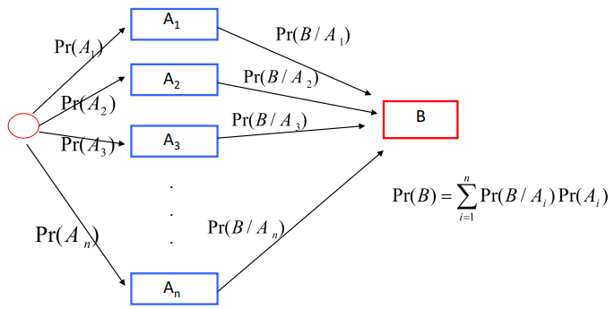
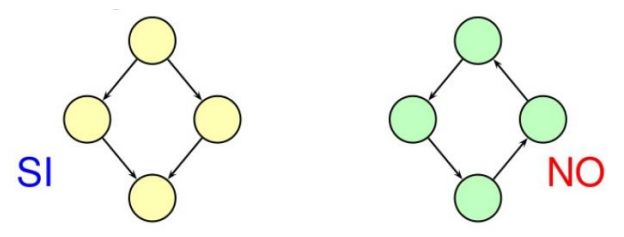
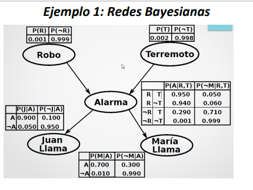
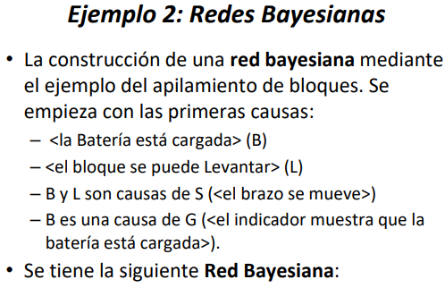
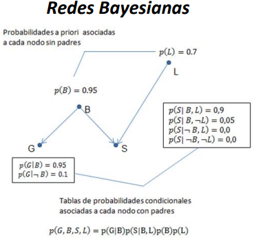

# Razonamiento Con Incertidumbre

## ¿Qué es incertidumbre?

Falta de información adecuada para tomar una decisión.

## Probabilidad Condicional
Fácil de entender bajo interpretación. 

## Inferencia Probabilística
En el escenario se tiene un conjunto de variables, cuyos valores pueden ser verdaderos o falsos. 

## Independencia Condicional

Una red bayesiana puede verse como una colección de sentencias que expresan independencia condicional.

### Independencia
Permite simplificar los modelos probabilísticos aplicando la regla de la cadena.

## Teorema de Bayes

Cálculo para medir la incertibumbre de la ocurrencia del evento B.

- Suponiendo que B ocurre. ¿Cuál de los sucesos Aj ha ocurrido?

##  Redes Bayesianas

### Definición:
Modelo gráfico probabilístico que permite describir distribuciones conjuntas complejas a partir de distribuaciones condicionales locales simples. (forma más basica de obtener conocimiento)

Grafo dirigido acíclico cuyos nodos estan etiquetados con variables aleatorias. 

Cada nodo es independiente de cualquier subconjunto de nodos que no sea descendientes.

En la gráfica se cumple:

- Formando por un conjunto de variables aleatorias. 
- Cada par de nodo se conecta entre si mediante un conjunto de enlaces.
- Hay una tabla de probabilidad condicional que sirve para cuantificar los efectos de los padres sobre el nodo.
- La gráfica no tiene ciclos dirigidos.

Ejemplo:

## Patrones de Inferencia en Redes Bayesianas

1. Inferencia Causal: De las causas a los efectos.
2. Inferencia de Diagnóstico: De los efectos a las causas.
3. Inferencia Intercausal: Entre las causas de un efecto común.

### - Inferencia Causal

Como el Hecho de que el Objeto sea elevable es una de las causas de que el brazo pueda moverse, se dice que este cálculo es un ejemplo
de Razonamiento Causal.

### - Inferencia de Diagnóstico

Como se está utilizando un efecto(o síntoma) para inferir una causa, a este tipo de razonamiento se denomina razonamiento de 
diagnóstico.

### - Inferencia Intercausal

Este tipo de inferencia utiliza un proceso de razonamiento causal(o descendente) incrustado en un proceso de diagnóstico(o ascendente).

## Evidencia con Incertidumbre

Para poder obtener los nodos de evidencia, tener la certeza de la verdad o falsedad de las proposiciones que representan.

