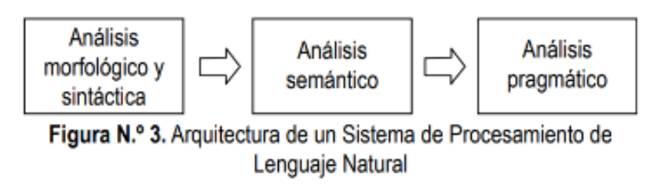

# Procesamiento de Lenguaje Natural

[commet]: <> (menu)

- [Procesamiento de Lenguaje Natural](#procesamiento-de-lenguaje-natural)
  - [¿Qué es el Procesamiento de Lenguaje Natural?](#qué-es-el-procesamiento-de-lenguaje-natural)
    - [Funcionamiento del Procesamiento de Lenguaje Natural](#funcionamiento-del-procesamiento-de-lenguaje-natural)
  - [Modelos PNL](#modelos-pnl)
  - [Componentes PNL](#componentes-pnl)
  - [Aplicaciones](#aplicaciones)

## ¿Qué es el Procesamiento de Lenguaje Natural?

El Procesamiento del Lenguaje Natural es el campo de conocimiento de la Inteligencia Artificial que se ocupa de investigar la manera de comunicar las máquinas con las personas mediante el uso de lenguas naturales, como el español, el inglés o el chino, debiendo ésta entender las oraciones que le sean proporcionadas.

### Funcionamiento del Procesamiento de Lenguaje Natural

El Procesamiento del Lenguaje Natural (PLN) hace uso de la Inteligencia Artificial y consiste en transformar el lenguaje natural en un lenguaje formal, como el de la programación, que los ordenadores puedan procesar. Se divide en elementos para entender la relacion entre ellos.

El PLN consta de dos fases principales:

**Procesamiento de datos**

Consiste en preparar y limpiar los datos de texto para que las máquinas puedan analizarlos.

- **Tokenización:** dividir el texto en unidades más pequeñas.
- **Eliminación de las palabras de entrada:** elimina las palabras comunes del texto y se queda con las palabras que ofrecen información.
- **Lematización y Stemming:** reducir las palabras a su raíz.
- **Etiqueta de partes del discurso:** etiquetar cada palabra con su parte de la oración (sustativos, verbos, adjetivos).

**Sistemas para procesar la información**

- **Sistema basado en Reglas:** aplica reglas, compara resultados. Tambien trabaja con la inferencia lógica, iniciando de una evidencia y llegando a la solución o bien partiendo de una hipotesis volviendo hacia atras hasta encontrar la evidencia.

- **Sistemas basados en Machine Learning:** Es una rama de la inteligencia artificial basada en la idea de que los sistemas pueden aprender de datos, identificar patrones y tomar decisiones con mínima intervención humana.

## Modelos PNL

**Modelos basados en Reglas**

Tienen un conjunto de reglas, una sintaxis bien definida, son costosos y requieren mucho tiempo. Las reglas deben ser definidas por expertos de la lingüística.

**Modelo Estadístico**

se usan técnicas de machine learning para recoger conjuntos de datos y generar patrones estadísticos de lenguaje natural, estos modelos utilizan técnicas de análisis de texto, minería de texto y estadística

Estos modelos se entrenan con grandes conjuntos de datos.

**Modelo basado en Redes Neuronales**

Son modelos que basan su arquitectura en redes neuronales profundas que permiten un aprendizaje jerárquico y una representación más compleja del lenguaje natural.

Actualmente el modelo de red neuronal más famoso es el de la generación de texto, donde se utiliza una red neuronal degenerativa para crear texto original.

**Modelos de aprendizaje por refuerzo**

Estos modelos se basan en la retroalimentación que reciben del entorno mejorando su rendimiento. Se usa en la creación de chatbots.

**Modelo GPT**

Modelo basado en arquitectura de transformadores, la arquitectura de transformadores es un tipo de red neuronal de aprendizaje profundo que utiliza múltiples capas de atención. La atención es un mecanismo que permite que la red se centre en las partes más específicas de una entrada de texto, para hacer predicciones más precisas.

Capas de Atención:
- Codificadores
- Decodificadores

## Componentes PNL

**Análisis morfológico o léxico**

Consiste en describir la forma, la composición y el significado de una palabra, es decir, el análisis interno de las palabras que forman oraciones para extraer lemas, rasgos flexivos, unidades léxicas compuestas. Es esencial para la información básica: categoría sintáctica y significado léxico.

**Análisis sintáctico**

Son reglas del lenguaje que permiten conocer y analizar cual es la estructura de la oración.

**Análisis semántico** 

Es la que proporciona el significado de las oraciones, basándose en el sentido de las palabras que lo componen y una vez eliminadas las ambigüedades morfosintácticas.

**Análisis pragmático**

Se analizan diferentes variables relevantes para la comprensión de un enunciado, incluyendo el análisis del contexto de uso a la interpretación final.

**FUNCIONAMIENTO**

1. El usuario expresa a la computadora lo que desea hacer.
2. En este paso se analizan las oraciones en el sentido morfológico y sintáctico.
3. A continuación se procede al análisis semántico, en el cual se da a las oraciones un significado.
4. Como siguiente paso realizamos el análisis pragmático, una vez analizadas las oraciones, ahora se analizan todas las juntas, tomando en cuenta la situacion de cada oracion, analizando las oraciones anteriores.
5. Una vez obtenida la expresión final, el siguiente paso es la ejecución de esta, para obtener así el resultado y poder proporcionarle al usuario.

## Aplicaciones

- Reconocimiento de patrones de lenguaje
- Recuperación de información
- Traducciones automáticas de idiomas
- Clasificación de información
- Resumen de textos
- Generación de lenguaje natural
- Sintesis de voz

