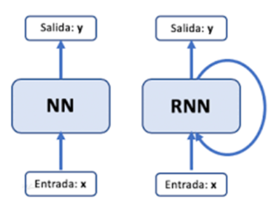
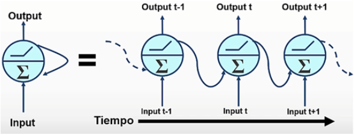
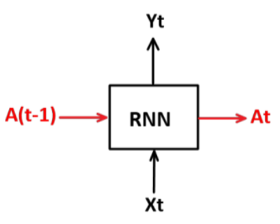
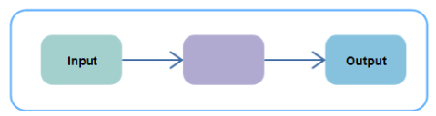
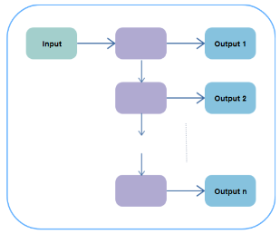
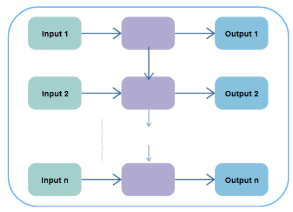
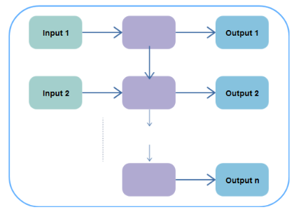

# **Redes Neuronales Recurrentes**

[commet]: <> (menu)
- [**Redes Neuronales Recurrentes**](#redes-neuronales-recurrentes)
  - [**Neurona Recurrente**](#neurona-recurrente)
  - [**¿Cúando utilizar las Redes Nueronales Recurrentes?**](#cúando-utilizar-las-redes-nueronales-recurrentes)
  - [**¿Cómo funcionan las Redes Neuronales Recurrentes?**](#cómo-funcionan-las-redes-neuronales-recurrentes)
  - [**¿Cómo puede predecir el siguiente carácter en la secuencia? ¿Dónde está la memoria de la Neurona?**](#cómo-puede-predecir-el-siguiente-carácter-en-la-secuencia-dónde-está-la-memoria-de-la-neurona)
  - [**Tipos de Redes Neuronales Recurrentes**](#tipos-de-redes-neuronales-recurrentes)
  - [**RNN one-to-many**](#rnn-one-to-many)
  - [**RNN many-to-many**](#rnn-many-to-many)
  - [**RNN y la retropropagación (backpropagation) a través del tiempo**](#rnn-y-la-retropropagación-backpropagation-a-través-del-tiempo)
  - [**Problema de las Redes Neuronales Recurrentes**](#problema-de-las-redes-neuronales-recurrentes)
    - [**Desvanecimiento del Gradiente**](#desvanecimiento-del-gradiente)
    - [**Explosión del Gradiente**](#explosión-del-gradiente)
  - [**Long Short-Term Memory “y” Gated Recurrent Unit**](#long-short-term-memory-y-gated-recurrent-unit)

Son un tipo de redes neuronales para procesar datos secuenciales o de series temporales.

La característica principal son sus conexiones recurrentes, este decir la salida de la red en un paso de tiempo se convierte en la entrada para el siguiente paso de tiempo.

## **Neurona Recurrente**

En una neurona recurrente la información no solo fluye en una dirección tambien se guarda en la memoria interna que luego es usada para producir una salida en el siguiente paso de tiempo.

La memoria se actualiza con la entrada actual y con el valor de la memoria anterior.

## **¿Cúando utilizar las Redes Nueronales Recurrentes?**

Cuando se tiene una secuencia de datos conocida como secuencias o series temporales, como:
  - Videos
  - Notas Musicales
  - Palabras
  - El clima

## **¿Cómo funcionan las Redes Neuronales Recurrentes?**

Lo que hace una ***RNN*** es que la salida tambien es la retroalimentación de tal manera que se convierte en la entrada del siguiente estado.

## **¿Cómo puede predecir el siguiente carácter en la secuencia? ¿Dónde está la memoria de la Neurona?**

En la figura en cada instante de tiempo la neurona tiene dos entradas y dos salidas, las entradas son el dato actual **Xt** y la activación anterior **A(t – 1)** mientras que las salidas son la predicción actual **Yt** y la activación actual **At**, esta activación de salida recibe el nombre de estado oculto, esta es la activación que corresponde precisamente a la memoria de la red, pues permite preservar y compartir la información entre un instante de tiempo y otro.

## **Tipos de Redes Neuronales Recurrentes**

**RNN one-to-one**

Permite una sola entrada y una única salida. Tiene tamaño de entrada y salida fijos.

Se usa en la clasificación de imagenes.

## **RNN one-to-many**

Toma una sola entrada y produce una secuencia de salidas.

Un ejemplo es el proceso de generación de subtítulos para videos o imágenes.

## **RNN many-to-many**

Many-to-many se utiliza para generar una secuencia de datos de salida a partir de una secuencia de unidades de entrada.

Se divide en dos subcategorias:

- **Equal unit size:** En este caso, el número de unidades tanto de entrada como de salida es el mismo.
  
  

- **Unequal Unit Size:** las entradas y salidas tienen un número diferente de unidades.
  
  

## **RNN y la retropropagación (backpropagation) a través del tiempo**

**Backpropagation**

La retropropagación se utiliza para calcular el gradiente de una función de error con respecto a los pesos de una red neuronal. El algoritmo trabaja en reversa a través de las distintas capas de gradientes para encontrar la derivada parcial de los errores con respecto a los pesos. Luego, la retropropagación utiliza estos pesos para disminuir los márgenes de error durante el entrenamiento.

Esas derivadas son luego utilizadas por el descenso de gradiente, un algoritmo que puede minimizar iterativamente una función dada. Luego, ajusta los pesos hacia arriba o hacia abajo, dependiendo de cuál disminuya el error.

## **Problema de las Redes Neuronales Recurrentes**

### **Desvanecimiento del Gradiente**

Durante cada iteración del entrenamiento de la red, cada uno de los pesos de la red neuronal recibe una actualización proporcionada por las derivadas parciales de la función de error con respecto al peso actual.

El problema del desvanecimiento del gradiente se presenta ya que en algunos casos el
gradiente se irá haciendo cada vez más pequeño, llegando a un punto donde evite el cambio del peso. En el peor de los casos, esto impediría completamente que la red neuronal siga entrenando.

### **Explosión del Gradiente**

En redes profundas o redes neuronales recurrentes, los gradientes de error pueden acumularse durante una actualización y dar lugar a gradientes muy grandes. Éstos, a su vez, dan lugar a grandes actualizaciones de los pesos de la red y, en consecuencia, a una red inestable. En un caso extremo, los valores de los pesos pueden llegar a ser tan grandes como para desbordarse y dar lugar a valores NaN.

El ***Gradient Clipping*** es una forma de mitigar este problema al limitar el tamaño de los gradientes. La idea básica es establecer un umbral máximo para los valores de los gradientes. Si algún gradiente excede este umbral, se ajusta o se recorta a un valor máximo permitido.

## **Long Short-Term Memory “y” Gated Recurrent Unit**

Long-Short Term Memory son una extensión de las redes neuronales recurrentes, que básicamente amplían su memoria para aprender de experiencias importantes que han pasado hace mucho tiempo. Las LSTM permiten a las RNN recordar sus entradas durante un largo período de tiempo. Esto se debe a que LSTM contiene su información en la memoria, que puede considerarse similar a la memoria de un ordenador , en el sentido que una neurona de una LSTM puede leer, escribir y borrar información de su memoria.

Una neurona ***LSTM*** consta de tres puertas:

- **Forget Gate:** Controla qué información anterior se olvida en una celda de memoria.
- **Input Get:** Controla qué nueva información se ingresa a una celda de memoria.
- **Output Get:** Controla qué información de la celda de memoria se utiliza como salida.

Y una celda de memoria.
- **Cell State:** Es la memoria a largo plazo en una red LSTM.
