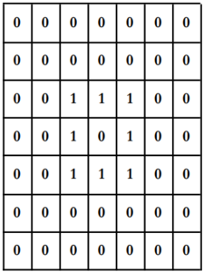
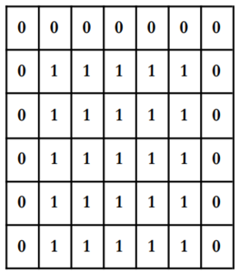
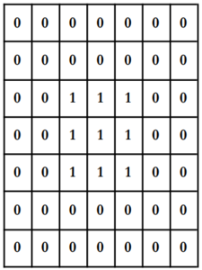

# Visión Artificial

[Atras](../README.md)

[comment]: <> (menu)

- [Visión Artificial](#visión-artificial)
  - [Historia](#historia)
  - [Aprendizaje Automático](#aprendizaje-automático)
    - [Procesamiento de Imágenes](#procesamiento-de-imágenes)
  - [Transformaciones Morfológicas](#transformaciones-morfológicas)
    - [Dilación Binaria](#dilación-binaria)
    - [Erorosión Binaria](#erorosión-binaria)
    - [Apertura](#apertura)
    - [Cierre](#cierre)
    - [Esqueletos](#esqueletos)
    - [Otras transformaciones](#otras-transformaciones)
  - [Técnicas de Segmentación](#técnicas-de-segmentación)
    - [Basada en  Umbralización](#basada-en--umbralización)
    - [Método P-Cuantil](#método-p-cuantil)
    - [Umbralización basada en la búsqueda de Mínimos](#umbralización-basada-en-la-búsqueda-de-mínimos)
    - [Segmentación basadas en Bordes](#segmentación-basadas-en-bordes)
      - [Extracción de la Frontera](#extracción-de-la-frontera)
      - [Seguimiento de Contorno](#seguimiento-de-contorno)
    - [Segmentación basada en Regiones](#segmentación-basada-en-regiones)
      - [Unión de Regiones](#unión-de-regiones)
      - [Crecimiento de Regiones por agregación de Piexeles](#crecimiento-de-regiones-por-agregación-de-piexeles)
  - [Extracción de Características](#extracción-de-características)
    - [Características basadas en bordes](#características-basadas-en-bordes)
    - [Características basadas en texturas](#características-basadas-en-texturas)
    - [Características basadas en formas](#características-basadas-en-formas)
    - [Características basadas en colores](#características-basadas-en-colores)
  - [Clasificación](#clasificación)
    - [Reconocimiento Facial](#reconocimiento-facial)
    - [Eigenfaces](#eigenfaces)
    - [Instancie](#instancie)
    - [Localización de Objetos](#localización-de-objetos)
    - [Uso del Contexto](#uso-del-contexto)
  - [Post Procesamiento](#post-procesamiento)
  - [Aplicaciones](#aplicaciones)

La visión artificial desarrolla algoritmos y sistemas que permiten a las computadoras "ver" y entender imagenes y videos.

**Proceso Básico:**

1. Adquisición de datos a través de una cámara u otros dispositivos.
2. Extraer información de esos datos con algoritmos de procesamiento de imágenes y aprendizaje automático.

## Historia
- 1950: uso de computadoras para analizar imagenes y extraer información, pero era de forma manual.
- 1960: se desarrollan algoritmos para procesar imagenes, técnicas de segmentación y detección de bordes.
- 1970: técnicas de reconocimiento de patrones y uso de la inteligencia artificial.
- 1980: primeros sistemas comerciales principalmente para el control de calidad.
- 1990: técnicas avanzadas como visión estéreo y visión 3D, tambien se desarrollan sistemas de reconocimiento de facial.
- 2000: importantes avances en el aprendizaje automático que permiten el desarrollo de sistemas de visión artificial más complejos.

## Aprendizaje Automático

En lugar de programar reglas para reconocer patrones podemos dejar que la computadora aprenda a reconocer estos patrones a partir de ejemplos.

### Procesamiento de Imágenes

1. **Adquisición de imágenes:** capturar imágenes con una cámara, escanear.
2. **Preprocesamiento:** mejorar la calidad de la imagen, eliminar ruido, mejorar contraste, etc.
3. **Segmentación:** identificar regiones de interes, mediante técnicas de umbralización, detección de bordes, etc.

## Transformaciones Morfológicas

Las transformaciones morfológicas se encargan de cambiar la forma y estructura de los objetos. Permiten obtener una idea de la estructura y forma de los objetos en una imagen.

### Dilación Binaria

Dados dos conjuntos $A$ y $B$ de $Z^2$, la dilatación denotada por $A \oplus B$ es el conjunto: $A \oplus B = {c \in E^N | c = a + b}$

|Mascara B|Figura A|A $\oplus$ B|
|----|----|-----|
||||

La dilatación, también llamada “crecimiento”, “llenado”, “expansión”, etc., produce un efecto de engrosamiento de los bordes del objeto.

### Erorosión Binaria

Dados dos conjuntos...

La erosión pone a cero todos los pixels de la imagen que no contengan completamente al elemento estructurante en su entorno.

|Mascara B|Figura A|A $\ominus$ B|
|----|----|-----|
||||

La erosión reduce los contornos de los objetos. Se utiliza para separar objetos que están unidos por una pequeña parte de sus contornos.

### Apertura

La apertura consiste en realizar en una imagen una erosión y después una
dilatación.

La apertura es muy utilizada para:

- Segmentación de objetos, separando unas formas de otras.
- Descomposición de objetos en elementos más simples.
- Extracción de formas determinadas en un entorno con ruido.
- Eliminar salientes estrechos.
- Separar objetos que no están demasiado pegados.
- Aumentar los agujeros que están dentro de los objetos.

### Cierre

El cierre hace exactamente lo contrario que la apertura, primero se realiza la dilatación y después la erosión.

### Esqueletos

Este tipo de operación reduce los objetos de una imagen, a un esqueleto de grosor de un pixel. Es decir, dado un objeto cualquiera va reduciendo su grosor hasta dejarlo con un grosor de un pixel.

### Otras transformaciones

... :)

## Técnicas de Segmentación

### Basada en  Umbralización

La umbralización es una técnica de segmentación que permite separar los objetos de una imagen de su fondo. Se basa en la idea de que los objetos y el fondo de una imagen tienen diferentes niveles de gris.

### Método P-Cuantil

Este método usa el conocimiento sobre el área o el  tamaño del objeto que se desea extraer para segmentar la imagen. 

Si *p* es el porcentaje que ocupa la imagen es posible usar esta información para particionar la imagen asignando *p* porciento de los piexeles a los objetos.

### Umbralización basada en la búsqueda de Mínimos

Dado el histograma de un objeto, se obtiene los valores mínimos y se asigna como valores iniciales de los umbrales buscados.

### Segmentación basadas en Bordes

#### Extracción de la Frontera

Las fronteras son bordes unidos que caracterizan la forma de un objeto, son útiles para calcular rasgos geométricos como tamaño u orientación.

Encontrar fronteras o bordes puede ser complicado debido a las definiciones de conectividad utilizadas.
- 4-conectividad: dos pixeles son 4-conectados si son adyacentes en las direcciones vertical y horizontal.
- 8-conectividad: dos pixeles son 8-conectados si son adyacentes en las direcciones vertical, horizontal y diagonal.

#### Seguimiento de Contorno

Los algoritmos de seguimiento de contorno trazan las fronteras ordenando los puntos de tipo borde sucesivos.

**Algoritmo de la Tortuga**

Este algoritmo se basa en la idea de que un contorno es una secuencia de puntos de borde conectados. El algoritmo comienza en un punto de borde y sigue el contorno hasta que regresa al punto de inicio.

### Segmentación basada en Regiones

#### Unión de Regiones

#### Crecimiento de Regiones por agregación de Piexeles

## Extracción de Características

Permite identificar y analizar características relevantes de una imagen que pueden ser útiles para la identificación de objetos o patrones en la misma.

### Características basadas en bordes

Los métodos basados en bordes pueden ser utilizados para detectar bordes en una imagen y luego utilizar estos bordes para extraer características como la forma y el tamaño de los objetos en la imagen.

### Características basadas en texturas

La textura se refiere a los patrones repetitivos de las características de la imagen, como la rugosidad, la suavidad, la granularidad, entre otros.

Utiles en la clasificación de objetos.

### Características basadas en formas

Utilizados para extraer características como el área, la relación de aspecto, la circularidad y la simetría de los objetos en la imagen.

Utiles en la clasificación de objetos.

### Características basadas en colores

Utilizados para extraer características como la distribución de colores en la imagen, la presencia de ciertos colores en la imagen y la relación entre los colores en la imagen.

Utiles en la clasificación de objetos.

## Clasificación

La clasificación implica la asignación de etiquetas a las regiones de interés identificadas en la imagen.

### Reconocimiento Facial

Es una tecnología de visión artificial que se utiliza para identificar y verificar la identidad de una persona mediante el análisis de características faciales únicas, como la forma de los ojos, la nariz, los labios y la estructura de la cara.

### Eigenfaces

Se basa en el concepto de que las imágenes faciales pueden ser representadas como una combinación lineal de componentes básicos o "eigenfaces", que son vectores de características que se derivan de un conjunto de imágenes faciales. Estos eigenfaces se utilizan para encontrar patrones y características distintivas de la cara humana que se pueden utilizar para identificar y reconocer rostros.

### Instancie

Identificar objetos o regiones específicas en una imagen o video, de manera que cada objeto o región se pueda analizar y comprender de forma independiente.

### Localización de Objetos

Detecta la presencia y ubicación de objetos o regiones de interés en una imagen o video. La localización de objetos puede ser realizada mediante técnicas de segmentación de imagen y análisis de características

### Uso del Contexto

Utiliza información adicional sobre el entorno en el que se encuentra un objeto o región de interés para mejorar la precisión de su detección o identificación.

## Post Procesamiento

El post procesamiento implica la mejora de la precisión y la calidad de la imagen después de la clasificación. Las técnicas de postprocesamiento comunes incluyen la eliminación de errores de clasificación y la mejora de la resolución de la imagen. Tiene como objetivo refinar los resultados obtenidos a través de la detección o clasificación para obtener una salida más precisa y coherente.

## Aplicaciones

- Inspección de calidad
- Reconocimiento de objetos
- Automatización de procesos
- Realidad aumentada
- Vehículos autónomos
- Medicina
- Agricultura de precisión

[ARRIBA](#visión-artificial)